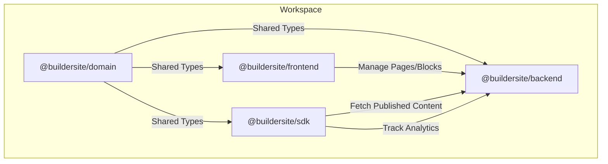

# Buildev – Open Source Visual CMS & AI Powered Page Builder


**Buildev** is a professional-grade, headless visual CMS and page builder monorepo. It empowers teams to build high-performance websites visually while maintaining a clean, developer-friendly headless architecture.

## Table of Contents
- [Architecture & Flow](#architecture--flow)
- [Features](#-features)
- [Technology Stack](#-technology-stack)
- [Installation](#-installation)
- [Usage Guide](#-usage-guide)
- [Roadmap](#roadmap)
- [Contributing](#-contributing)
- [License](#-license)

## Architecture & Flow

Buildev follows a monorepo structure where the domain logic is shared across the entire stack, ensuring type-safe communication between the editor, backend, and SDK.



## 🚀 Features

- **Hybrid Editor**: Seamless switching between **Design Mode** (Visual Canvas) and **Code Mode** (Monaco Editor).
- **Responsive Design**: Mobile-first approach with real-time preview for Desktop, Tablet, and Mobile.
- **Design System**: Built-in token management for colors, typography, and spacing.
- **Headless SDK**: A lightweight TypeScript SDK for fetching and rendering content in any project.
- **Modern Stack**: Built with Vue 3, Vite, Express, and Prisma for high performance and reliability.

## 🛠️ Technology Stack

- **Frontend**: [Vue 3](https://vuejs.org/), [Vite](https://vitejs.dev/), [Pinia](https://pinia.vuejs.org/)
- **Backend**: [Node.js](https://nodejs.org/), [Express](https://expressjs.com/)
- **Language**: [TypeScript](https://www.typescriptlang.org/) (Strict mode)
- **Database**: [Prisma ORM](https://www.prisma.io/) (SQLite/PostgreSQL)
- **Editor**: [Monaco Editor](https://microsoft.github.io/monaco-editor/)
- **Validation**: [Zod](https://zod.dev/)

## 📦 Installation

1.  **Clone the repository:**
    ```bash
    git clone https://github.com/bryfar/buildev.git
    cd buildev
    ```

2.  **Install dependencies:**
    ```bash
    yarn install
    ```

3.  **Environment Setup:**
    Configure your database in `apps/buildev-backend/.env` (default is SQLite), then generate the Prisma client:
    ```bash
    yarn workspace @buildersite/backend db:generate
    yarn workspace @buildersite/backend db:migrate
    ```

4.  **Run the development server:**
    Run both the backend and the editor from the root:
    ```bash
    # Start Backend API (at http://localhost:4000)
    yarn dev:backend

    # Start Editor Frontend (at http://localhost:5173)
    yarn dev:editor
    ```

## 📖 Usage Guide

### Dashboard
- **Create Project**: Start a new project from scratch.
- **Manage**: View recent projects, delete, or search.
- **Pages**: Manage the site hierarchy and published status.

### Editor
- **Design Mode**:
    - **Canvas**: Drag and drop elements or select predefined blocks.
    - **Inspector**: Edit properties (Layout, Typography, Effects) in the Right Sidebar.
    - **Layers**: Manage the DOM tree in the Left Sidebar.
- **Code Mode**:
    - Full-featured Monaco editor for custom component logic.
    - Changes in code reflect in the canvas (and vice-versa).
- **Preview**: Test responsiveness on different device frames.

## Roadmap

### Planned Features
- **AI Assistant**: Specialized AI chat for generating components and refactoring code.
- **Figma Import**: Convert Figma designs directly into Buildev pages.
- **GitHub Sync**: Push and pull page configurations directly from your repository.

### Future Goals
- Community-driven block marketplace.
- Native React/Next.js and Svelte SDK wrappers.

## 🤝 Contributing

We welcome contributions! Please follow these steps:

1.  Fork the repository.
2.  Create a new branch (`git checkout -b feature/AmazingFeature`).
3.  Commit your changes (`git commit -m 'Add some AmazingFeature'`).
4.  Push to the branch (`git push origin feature/AmazingFeature`).
5.  Open a Pull Request.

## 📄 License

This project is licensed under the MIT License - see the [LICENSE](LICENSE) file for details.

---

**Built with ❤️ by the Buildev Team**
