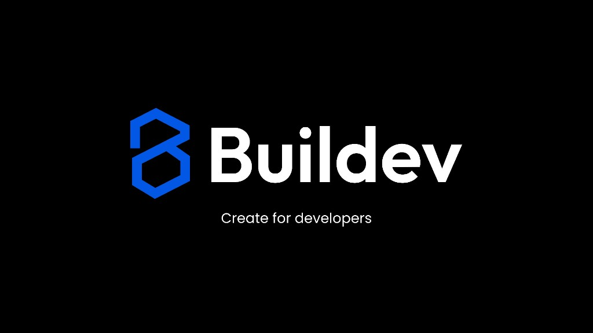

# Buildev — Open Source AI Web Builder ✨



> The VS Code of web builders. Design visually. Export clean code.
> **Open source, AI-native, multi-framework, zero vendor lock-in.**

[](#)
[](https://opensource.org/licenses/MIT)
[](#)
[](./SECURITY.md)
[](./CODE_OF_CONDUCT.md)

## ⚡ Why Buildev?

| Feature | Webflow | Framer | V0 / Lovable | **Buildev** |
| :--- | :---: | :---: | :---: | :---: |
| **Open Source** | ✗ | ✗ | ✗ | **✅ MIT** |
| **Visual Editor** | ✅ | ✅ | ✗ | **✅** |
| **AI Vision (Img-to-Code)** | ✗ | ✗ | ✅ | **✅** |
| **Clean Export** | ✗ | ✗ | ✅ (React) | **✅ (React/Vue/HTML)** |
| **BYOK AI** | ✗ | ✗ | ✗ | **✅** |
| **GitHub Sync** | Parcial | ✗ | ✗ | **✅ Native** |
| **Price** | $29+/mo | $15+/mo | $20+/mo | **$0 (Self-host)** |

---

## 🚀 Quick Start

```bash
# Clone and install in < 2 minutes
git clone https://github.com/bryfar/buildev.git
cd buildev
corepack yarn install

# Terminal 1 (frontend)
corepack yarn dev:editor

# Terminal 2 (backend)
corepack yarn dev:backend
```

[](https://vercel.com/new/clone?repository-url=https%3A%2F%2Fgithub.com%2Fbryfar%2Fbuildev)
[](https://deploy.workers.cloudflare.com)

---

## ▲ Deploy Frontend on Vercel

The repo includes a root [`vercel.json`](./vercel.json) so Vercel can build from the **repository root** (Vite needs `index.html` inside `apps/buildev-frontend`).

**Option A — Root directory = repo root (default)**

1. Import the repository in Vercel and leave **Root Directory** empty (or `.`).
2. Do not override Install / Build / Output in the dashboard (the root `vercel.json` sets them).
3. Add **`VITE_API_URL`** = your deployed backend URL (no trailing slash), then redeploy. If it is missing, the build still completes but you get a **warning** in the logs (and the app will not reach a real API until you set it); set **`VITE_FAIL_BUILD_WITHOUT_API_URL=1`** for a strict failing build, or **`VITE_ALLOW_EMPTY_API_URL=1`** to silence the warning.

**Option B — Root directory = `apps/buildev-frontend`**

1. Set **Root Directory** to `apps/buildev-frontend`.
2. **Build Command**: `corepack yarn build` · **Output Directory**: `dist`
3. Add `VITE_API_URL` as above.

You can copy `apps/buildev-frontend/.env.example` for local development.

---

## ▲ Deploy API (Express + Prisma) — Vercel u otro host

El **frontend** en Vercel solo sirve estáticos; el **API** vive en **otra URL** (otro proyecto Vercel, Railway, Fly, etc.). En el proyecto del **front** debes definir **`VITE_API_URL`** = URL pública del API (sin `/` final) y **volver a desplegar** el front.

### Solución definitiva en Vercel (dos proyectos)

| Proyecto | Root Directory | Qué hace |
| :--- | :--- | :--- |
| **Frontend** | Raíz del repo (vacío) | Usa el [`vercel.json`](./vercel.json) del repo: build del editor. **Variable obligatoria:** `VITE_API_URL=https://tu-api.vercel.app` |
| **Backend (API)** | `apps/buildev-backend` | Usa [`apps/buildev-backend/vercel.json`](./apps/buildev-backend/vercel.json): instala el monorepo y ejecuta `vercel-build`. Express queda en la URL que asigne Vercel. |

1. Crea el **proyecto del API** con Root = `apps/buildev-backend` y conecta el mismo repositorio.
2. En ese proyecto, añade las **variables de entorno** del API: `DATABASE_URL`, `JWT_SECRET`, OAuth (`GITHUB_*`, `GOOGLE_*`), etc. Copia [`apps/buildev-backend/.env.example`](./apps/buildev-backend/.env.example). Para OAuth en producción, define **`PUBLIC_APP_URL`** = URL del front (sin `/` final) o las URIs explícitas `GITHUB_LOGIN_REDIRECT_URI` / `GOOGLE_LOGIN_REDIRECT_URI` según GitHub/Google Console.
3. Despliega el API y copia su URL (p. ej. `https://buildev-api.vercel.app`).
4. En el **proyecto del front**, Settings → Environment Variables → **`VITE_API_URL`** = esa URL (Production y Preview si aplica). **Redeploy** del front.
5. Comprueba: `GET https://tu-api…/api/health` debe devolver JSON; el login del front debe llamar al mismo host vía `VITE_API_URL`.

**Migraciones en cada deploy:** el script `vercel-build` del backend ejecuta `prisma migrate deploy` (necesitas `DATABASE_URL` en el **build** del proyecto del API).

Si no puedes migrar en el build, ejecuta **una vez** en tu Postgres (Neon, Supabase, etc.):

   `ALTER TABLE "User" ALTER COLUMN "passwordHash" DROP NOT NULL;`

   (equivale a la migración `20260413120000_oauth_optional_password`).

---

## 🧭 Understand Buildev Fast

If you are new, read in this order:

1. [CONTRIBUTING.md](./CONTRIBUTING.md) for setup and project flow map
2. [AGENTS.md](./AGENTS.md) for coding constraints and architecture context
3. [CLAUDE.md](./CLAUDE.md) for workspace structure and standards
4. `docs/agent/*.md` for deep architecture details

---

## 🛠️ Key Capabilities

- **✨ AI Vision Scanner**: Drop a screenshot and convert it into editable `BuildevNode` AST nodes instantly.
- **🏗️ Multi-Framework Codegen**: Generate high-fidelity code for **React**, **Vue 3**, or plain **HTML/CSS**.
- **🔁 Code Mode Autosync**: Edit `src/blocks.json` or `src/App.vue` in Code Mode and sync changes back to the visual builder automatically.
- **🧩 Project-Type Dashboard**: Each project opens dashboard mode by type (`landing`, `multisite`, `cms`).
- **📰 CMS Sidebar Navigation**: CMS projects include grouped navigation for Content, Manage, and Admin sections.
- **🎨 Reusable Design Systems**: Create a design system once, reuse it across projects, and preview components before publishing.
- **🧱 Component Presets Library**: Includes ready-to-use section families plus `Navbar` variants for fast page composition.
- **🔌 Marketing and CRM Plugins**: Install integrations for Google marketing apps and CRM platforms per project.
- **📡 Developer Sync**: Native GitHub integration. Sync your design directly as code in your favorite repository.
- **🤖 Agent-First Architecture**: Built for humans and AIs. Includes `.claude/`, `.opencode/`, and standardized `skills/` for AI agents.
- **🔌 MCP Ready**: Model Context Protocol server integrated for automated site building via natural language.

---

## 📦 Monorepo Structure

- `apps/editor`: The core visual builder (Vue 3, Pinia, Monaco).
- `apps/api`: The orchestration layer (Express, Prisma, GitHub OAuth).
- `packages/core`: The single source of truth (AST Schema, Zod).
- `packages/codegen`: The translation engine (AST -> Framework).
- `packages/ai-engine`: High-fidelity vision and chat processing (BYOK).
- `packages/mcp-server`: AI-to-Editor automation interface.

---

## 🤝 Contributing

We are an "Agent-First" project. Whether you are a human or an AI agent, please check our [AGENTS.md](./AGENTS.md) and [CONTRIBUTING.md](./CONTRIBUTING.md) to get started.

The contributing guide now includes:
- quick path for users that only want to run Buildev
- quick path for contributors
- installation and project flow diagram (Landing page, Multisitio, CMS, and CMS Astro policy)

### AI Agent Onboarding
If you are an AI assistant, start by reading the [skills/](./skills/) directory to learn about our architecture and how to create new components.

### Open Source Project Docs
- [Code of Conduct](./CODE_OF_CONDUCT.md)
- [Security Policy](./SECURITY.md)
- [Governance](./GOVERNANCE.md)

---

## 📄 License

This project is licensed under the MIT License - see the [LICENSE](LICENSE) file for details.

**Built with ❤️ by the Buildev Team**
